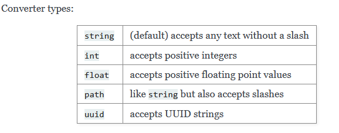

# Flask con Python

## Ejecucion Del Programa
----
Primer "Hola Mundo" con Flask

```
from flask import Flask

app = Flask(__name__)

@app.route("/")
def hello_world():
    return "<p>Hello, World!</p>"
```

Para ejecutar el archivo tenemos dos opciones

- flask --app hello run
- flask --app hello run --debug

Mejor Opcion en casos de produccion es usando la palabra reservada "--debug"

## Rutas en Flask
----

Para el Primer Caso, la ruta defecto es la ruta <b>root</b>
```
@app.route('/')
def index():
    return 'Index Page'
```
En el segundo caso, se esta especificando una ruta por defecto

```
@app.route('/hello')
def hello():
    return 'Hello, World'
```

## Rutas Dinamicas en Flask
----

Para este caso, se esta creando una ruta dinamica, por cada nombre que nosotros ingremos 

- http://127.0.0.1:5000/juan
- http://127.0.0.1:5000/pepe
- http://127.0.0.1:5000/luis

```
from markupsafe import escape

@app.route("/<name>")
def hello(name):
    return f"Hello, {escape(name)}!"
```

## Rutas Unicas
----

El usas "/" al final de tu ruta, da una mejor seguridad y evitar que tengas problemas 

- http://127.0.0.1:5000/projects/
- http://127.0.0.1:5000/projects

No existira ningun problema

```
@app.route('/projects/')
def projects():
    return 'The project page'
```

Si tu no usas el "/" al final de tu ruta, va a funcionar con normalidad pero si tu le agregas el "/", tendras un error

- http://127.0.0.1:5000/about -> bien
- http://127.0.0.1:5000/about/ -> error

```
@app.route('/about')
def about():
    return 'The about page'
```

## Valor de entrada por Ruta
---

En este caso, se va poner como parametro el tipo de ruta que se va a recibir, sea el caso un <b>string</b>,<b>int</b>,<b>float</b> y etc


```
from markupsafe import escape

@app.route('/user/<username>')
def show_user_profile(username):
    # show the user profile for that user
    return f'User {escape(username)}'

@app.route('/post/<int:post_id>')
def show_post(post_id):
    # show the post with the given id, the id is an integer
    return f'Post {post_id}'

@app.route('/path/<path:subpath>')
def show_subpath(subpath):
    # show the subpath after /path/
    return f'Subpath {escape(subpath)}'
```



### Base en HTML

Vamos a tener usar un archivo <br>base.html</br> para optinizar el contenido de las paginas, esto evitara la redundancia que existe por pagina

> La forma de hacer la conexion entre la <br>base</br> y <br>otras Paginas</br> seran por medio de este codigo


```html

```

> Para nosotros personalizar el titulo de la pagina es por medio de este codigo

- base

```html
    <title>
        
        
    </title>
```

- Otras Paginas

```html

Home Page

```
> Para enviar el contenido de las paginas segun, tenemos que especificar el broque con las etiquetas 

- base
```


```

- Otras Paginas

```html

      <table class="table table-hover table-dark">
        <thead>
            <tr>
                <!-- Your Columns HERE -->
                <th scope="col">ID</th>
                <th scope="col">Name</th>
                <th scope="col">Barcode</th>
                <th scope="col">Price</th>
                <th scope="col">Options</th>
            </tr>
        </thead>
    </table>


```